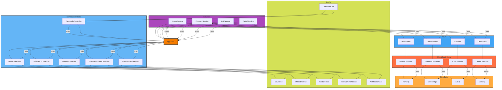

```mermaid

flowchart TD
    %% DAOs
    subgraph DAOs
        style DAOs fill:#d4e157,stroke:#333,stroke-width:2px
        G[DemandeDao]
        H[DevisDao]
        I[UtilisateurDao]
        J[FactureDao]
        K[BonCommandeDao]
        L[NotificationDao]
    end

    %% Server Controllers
    subgraph ServerControllers
        style ServerControllers fill:#64b5f6,stroke:#333,stroke-width:2px
        A[DemandeController]
        B[DevisController]
        C[UtilisateurController]
        D[FactureController]
        E[BonCommandeController]
        F[NotificationController]
    end

    %% Client Controllers
    subgraph ClientControllers
        style ClientControllers fill:#ff7043,stroke:#333,stroke-width:2px
        AA[AskController]
        BB[ConnectController]
        CC[DetailController]
        DD[HomeController]
    end

    %% Services
    subgraph Services
        style Services fill:#ab47bc,stroke:#333,stroke-width:2px
        N[HomeService]
        O[ConnectService]
        P[AskService]
        Q[DetailService]
    end

    %% Views
    subgraph Views
        style Views fill:#42a5f5,stroke:#333,stroke-width:2px
        R[HomeView]
        S[ConnectView]
        T[AskView]
        U[DetailView]
    end

    %% JavaScript
    subgraph JavaScript
        style JavaScript fill:#ffab40,stroke:#333,stroke-width:2px
        V[Home.js]
        W[Connect.js]
        X[Ask.js]
        Y[Detail.js]
    end

     %% Central File with Custom Shape
    M[App.java]
    style M fill:#f57c00,stroke:#333,stroke-width:2px
    %% Layout: Server Controllers and DAOs
    A --- G
    B --- H
    C --- I
    D --- J
    E --- K
    F --- L

    %% Layout: Server DAOs and Controllers
    G --- A
    H --- B
    I --- C
    J --- D
    K --- E
    L --- F

    %% Layout: App.java to Controllers
    M --- A
    M --- B
    M --- C
    M --- D
    M --- E
    M --- F

    %% Layout: Services to App.java
    N --- M
    O --- M
    P --- M
    Q --- M

    %% Layout: Services to Views
    N --- R
    O --- S
    P --- T
    Q --- U

    %% Layout: Views to Controllers
    R --- DD
    S --- BB
    T --- AA
    U --- CC

    %% Layout: Controllers to JavaScript
    DD --- V
    BB --- W
    AA --- X
    CC --- Y

   

    %% App.java Connections
    A -->|Uses| M
    B -->|Uses| M
    C -->|Uses| M
    D -->|Uses| M
    E -->|Uses| M
    F -->|Uses| M

    %% Services Connections
    N -->|Uses| M
    O -->|Uses| M
    P -->|Uses| M
    Q -->|Uses| M

    %% View to Services Connections
    R -->|Uses| N
    S -->|Uses| O
    T -->|Uses| P
    U -->|Uses| Q

    %% Controllers to JavaScript
    DD -->|Uses| V
    BB -->|Uses| W
    AA -->|Uses| X
    CC -->|Uses| Y


```
